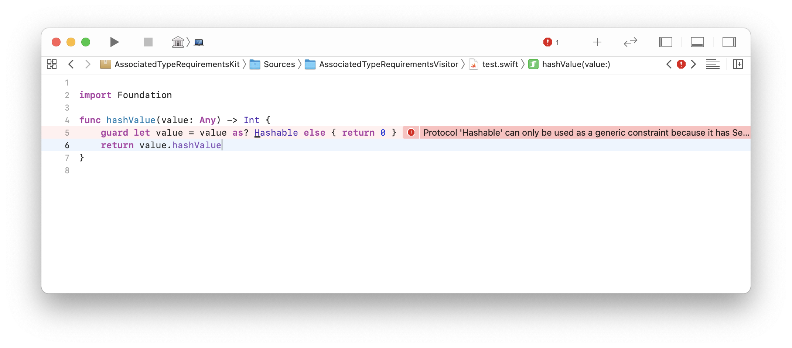

# AssociatedTypeRequirementsKit

Is Swift bothering you with those pesky error messages? Something something about associated type requirements. Like when you want to cast something to a protocol, but then:



Well not to worry. Introducing AssociatedTypeRequirementsKit 🤗
A collection of µFrameworks to help you get around those annoying scenarios!

Our example from before is dealt like so:

```swift
import AssociatedTypeRequirementsVisitor

private let hasher = AnyHasher()

func hashValue(value: Any) -> Int {
    return hasher(value) ?? 0
}

struct AnyHasher: HashableVisitor {
    func callAsFunction<T : Hashable>(_ value: T) -> Int {
        return value.hashValue 
    }
}
```

## Installation
### Swift Package Manager

You can install AssociatedTypeRequirementsKit via [Swift Package Manager](https://swift.org/package-manager/) by adding the following line to your `Package.swift`:

```swift
import PackageDescription

let package = Package(
    [...]
    dependencies: [
        .package(url: "https://github.com/nerdsupremacist/AssociatedTypeRequirementsKit.git", from: "0.1.0")
    ]
)
```

## Usage

### AssociatedTypeRequirementsVisitor

If you want to be able to call a function on a protocol with associated types, then you'll have to provide a generic function. Since closures cannot be generic, we have to use a protocol to encode this.

For example if you want to be able to turn any SwiftUI view into an AnyView, but you don't know the type at compile time, you can use `ViewVisitor`:

```swift
import AssociatedTypeRequirementsVisitor
import SwiftUI

private let converter = AnyViewConverter()

extension AnyView {
    init?(_ value: Any) {
        guard let view = converter(value) else { return nil }
        self = view
    }
}

private struct AnyViewConverter : ViewVisitor {
    // Provide a function that can be called with all the necessary type information
    func callAsFunction<T : View>(_ value: T) -> AnyView {
        return AnyView(value)
    }
}
```

But why would you need to do this? Well, for example if you want to get all the subviews of a tuple view?

```swift
extension TupleView {

    func subviews() -> [AnyView] {
        let mirror = Mirror(reflecting: self)
        let tuple = mirror.children.first!.value
        let tupleMirror = Mirror(reflecting: tuple)
        return tupleMirror.children.map { AnyView($0.value)! }
    }

}
```

`ViewVisitor` is available out of the box because we are already shipping visitor protocols for the most important problematic protocols in Swift right now, and are extending the list as we go.
If you have to handle your own protocol you can do it as in the following example:

```swift
protocol MyProtocolVisitor: AssociatedTypeRequirementsVisitor {
    associatedtype Visitor = MyProtocolVisitor
    associatedtype Input = MyProtocol
    associatedtype Output
    
    func callAsFunction<T : MyProtocol>(_ value: T) -> Output
}
```

### Casting

If you don't want to use the `AssociatedTypeRequirementsVisitor` API, you can also ask use the low level `withCasted` API and ask for the protocol conformance yourself.

```swift
import Casting

func test(value: Any) -> AnyHashable? {
    return withCasted(value, as: .hashable) { casted in 
        // casted is CastedProtocolValue
        ...
    }
}
```

But what is this `CastedProtocolValue`? Well it's a little struct that has the same layout that a function `func anyHashable<T : Hashable>(hashable: T)` would expect. So that function could be casted:

```swift
import Casting

func test(value: Any) -> AnyHashable? {
    return withCasted(value, as: .hashable) { casted in 
        // A pointer to the function is in `functionPointer`
        let function = unsafeBitCast(functionPointer, (@convention(thin) (CastedProtocolValue) -> AnyHashable).self)
        return function(casted)
    }
}
```

### ValuePointers

When you use the `withUnsafePointer` API from the Swift Standard Library, but with `Any` you'll notice that the pointer or bytes you get are not quite correct. 
That's becasue they're pointing to the existential container `Any`, which is always 32 Bytes.

That's why we ship `withUnsafeValuePointer` which will always point to the actual value, instead of the container:

```swift
import ValuePointers

struct MyStruct {
    let first: String
    let second: String
}

let value = MyStruct(first: "A", second: "B") as Any
let secondString = withUnsafeValuePointer(to: value) { $0.assumingMemoryBound(to: String.self).advanced(by: 1).pointee }

// "B"
print(secondString)
```

### ProtocolType

Whenever you want to access the meta-type of a protocol with associated types, you'll run into this exact same problem.
You can use `ProtocolType` to access it via the name of the protocol:

```swift
import ProtocolType

let protocolType = ProtocolType(moduleName: "SwiftUI", protocolName: "View")
print(protocolType?.type) // SwiftUI.View.self
```

And ProtocolType provides a set of constants already shipped. The list of constants can be changed in the `commonProtocols.json` file and can be extended further:

```swift
import ProtocolType

func hash(protocol protocolType: ProtocolType) -> some Hashable {
    return unsafeBitCast(type, as: Int.self)
}

let hashed = hash(protocol: .collection)
```

## Contributions
Contributions are welcome and encouraged!

## License
AssociatedTypeRequirementsKit is available under the MIT license. See the LICENSE file for more info.
